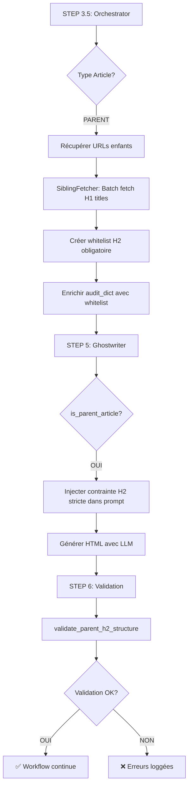

# Guide: Système de Whitelist H2 pour Articles PARENT

## Problème Résolu

**Avant** : L'IA générait des H2 hors du cocon sémantique, violant la règle **H2 du PARENT = H1 du CHILD**.

**Exemple d'erreur** :
```html
<!-- Article PARENT -->
<h2>Quel est le moyen le plus efficace d'apprendre l'anglais ?</h2>
<!-- ❌ Ce H2 n'est PAS un H1 d'article enfant ! -->
```

**Après** : L'IA reçoit une **whitelist stricte** des H2 obligatoires et **ne peut PAS** en créer d'autres.

---

## Architecture de la Solution

### 1. Détection du Type d'Article (STEP 3.5 - Orchestrator)

**Fichier** : [`scripts/agent/orchestrator.py`](scripts/agent/orchestrator.py)

```python
# Détection automatique du type d'article
if cocon_structure['parent_url']:
    post_type = "CHILD"
elif cocon_structure['sibling_urls']:
    post_type = "PARENT"  # ← Article pilier avec enfants
else:
    post_type = "STANDALONE"
```

### 2. Récupération des H1 Enfants (PARENT only)

**Pour les articles PARENT**, le système :

1. **Détecte** les URLs des articles enfants (via HTML analysis)
2. **Récupère** les titres H1 de chaque enfant via `SiblingFetcher` :
   - **Priorité 1** : Lecture depuis le spreadsheet (colonnes B, C, D)
   - **Fallback** : Scraping HTML si URL absente du spreadsheet
3. **Crée** une whitelist H2 obligatoire : `mandatory_h2_titles = [H1_1, H1_2, H1_3...]`

```python
# Fetch sibling metadata (H1 titles) via SiblingFetcher
from ..cocon import SiblingFetcher
sibling_fetcher = SiblingFetcher(self.sheets_client, self.web_scraper)
siblings = sibling_fetcher.fetch_batch(cocon_structure['sibling_urls'])

# Extract H1 titles (= mandatory H2s for this PARENT)
child_h1_titles = [sibling.h1 for sibling in siblings if sibling.h1]
```

**Résultat** : `audit_dict` est enrichi avec :

```python
audit_dict["cocon_whitelist"] = {
    "post_type": "PARENT",
    "is_parent_article": True,
    "mandatory_h2_titles": [
        "Comment choisir sa ville pour apprendre l'anglais au Royaume-Uni ?",
        "Quel type de séjour pour apprendre l'anglais au Royaume-Uni ?",
        "Combien coûte un séjour linguistique au Royaume-Uni ?",
    ],
    "child_count": 3,
}
```

---

### 3. Enrichissement du Prompt (STEP 5 - Ghostwriter)

**Fichier** : [`scripts/ghostwriter/ghostwriter.py`](scripts/ghostwriter/ghostwriter.py)

Le `Ghostwriter` détecte si `is_parent_article = True` et injecte une **contrainte stricte** dans le prompt :

```markdown
## STRUCTURE H2 OBLIGATOIRE (ARTICLE PARENT - PRIORITÉ ABSOLUE)

Cet article est un **PARENT** dans un cocon sémantique.

**RÈGLE ABSOLUE** : Les H2 doivent correspondre **EXACTEMENT** aux H1 des articles enfants.

### H2 OBLIGATOIRES (liste exhaustive)

1. **Comment choisir sa ville pour apprendre l'anglais au Royaume-Uni ?**
2. **Quel type de séjour pour apprendre l'anglais au Royaume-Uni ?**
3. **Combien coûte un séjour linguistique au Royaume-Uni ?**

**TOTAL : 3 H2 OBLIGATOIRES**

### INTERDICTIONS (ARTICLE PARENT)

- ❌ **AUCUN autre H2** n'est autorisé en dehors de cette liste
- ❌ Pas de H2 "Conclusion", "Introduction", "Pour aller plus loin"
- ❌ Pas de reformulation des H2 (utiliser **EXACTEMENT** le texte des H1 enfants)

### OBLIGATIONS (ARTICLE PARENT)

- ✅ Utiliser **TOUS** les H2 de la liste (aucun oubli, aucune exception)
- ✅ Respecter un ordre logique pour la progression du lecteur
- ✅ Chaque H2 contient **UN SEUL** lien vers l'article enfant correspondant
```

**Code** :

```python
# _format_whitelist_prompt() génère le prompt ci-dessus
if whitelist_data.get("is_parent_article", False):
    mandatory_h2s = whitelist_data.get("mandatory_h2_titles", [])
    if mandatory_h2s:
        context["parent_h2_whitelist"] = self._format_whitelist_prompt(mandatory_h2s)
```

---

### 4. Validation Post-Génération

**Méthode** : `Ghostwriter.validate_parent_h2_structure()`

Après génération par l'IA, le système **valide automatiquement** :

```python
validation = ghostwriter.validate_parent_h2_structure(
    generated_html=refreshed_html,
    mandatory_h2s=child_h1_titles,
    strict=True  # Rejette tout H2 hors whitelist
)

if not validation["valid"]:
    # ❌ Erreurs détectées : H2 manquants ou H2 extra
    errors = validation["errors"]
    # Exemple: ["1 H2 hors whitelist: Quel est le moyen le plus efficace d'apprendre l'anglais ?"]
```

**Validation** :
- ✅ **H2 manquants** : Détecte les H1 enfants oubliés
- ✅ **H2 extra** : Détecte les H2 hors whitelist (mode strict)
- ✅ **Normalisation** : Case-insensitive, ignore espaces multiples

---

## Workflow Complet (PARENT Article)



---

## Exemple Concret

### Contexte

**Article PARENT** : "Apprendre l'anglais au Royaume-Uni"
**Articles CHILD** :
1. "Comment choisir sa ville pour apprendre l'anglais au Royaume-Uni ?"
2. "Quel type de séjour pour apprendre l'anglais au Royaume-Uni ?"
3. "Combien coûte un séjour linguistique au Royaume-Uni ?"

### Résultat Attendu

```html
<h1>Apprendre l'anglais au Royaume-Uni : guide complet 2026</h1>

<p>Introduction générale sur l'apprentissage de l'anglais au Royaume-Uni...</p>

<h2>Comment choisir sa ville pour apprendre l'anglais au Royaume-Uni ?</h2>
<p>Le choix de la ville impacte votre expérience d'immersion. Découvrez notre <a href="/choisir-ville-anglais-royaume-uni">comparatif détaillé des villes britanniques</a> pour trouver celle qui correspond à vos objectifs.</p>
<!-- 2-3 paragraphes développement (150-250 mots) -->

<h2>Quel type de séjour pour apprendre l'anglais au Royaume-Uni ?</h2>
<p>De nombreuses formules existent, du cours intensif à l'immersion en famille. Consultez notre <a href="/type-sejour-anglais-royaume-uni">guide des différents types de séjours linguistiques</a> pour choisir la formule adaptée.</p>
<!-- 2-3 paragraphes développement (150-250 mots) -->

<h2>Combien coûte un séjour linguistique au Royaume-Uni ?</h2>
<p>Le budget varie selon la durée et le type de séjour. Notre <a href="/cout-sejour-linguistique-royaume-uni">analyse détaillée des prix</a> vous aide à anticiper les coûts.</p>
<!-- 2-3 paragraphes développement (150-250 mots) -->
```

**Validation** : ✅ 3/3 H2 présents, 0 H2 extra, tous les H2 correspondent exactement aux H1 enfants

---

## Tests de Non-Régression

**Fichier** : [`test_parent_h2_whitelist.py`](test_parent_h2_whitelist.py)

```bash
python test_parent_h2_whitelist.py
```

**Tests couverts** :
1. ✅ HTML valide (tous les H2 présents, aucun extra)
2. ✅ HTML invalide (H2 hors whitelist détecté)
3. ✅ HTML invalide (H2 manquant détecté)
4. ✅ Normalisation (case-insensitive, espaces)

---

## Règles de Maillage Interne (Rappel)

**Pour articles PARENT** (règles automatiques dans le prompt) :

- ✅ **Chaque H2** = Titre H1 exact de l'article enfant correspondant
- ✅ **Chaque H2** contient UN SEUL lien vers l'article enfant
- ✅ **Lien intégré naturellement** dans la première phrase après le H2
- ❌ **Pas de liens répétés** vers le même enfant
- ❌ **Pas de H2 hors whitelist** (Conclusion, FAQ, etc.)

---

## Fichiers Modifiés

| Fichier | Modifications |
|---------|---------------|
| [`scripts/agent/orchestrator.py`](scripts/agent/orchestrator.py) | STEP 3.5 : Détection PARENT + Fetch H1 enfants + Enrichir `audit_dict` |
| [`scripts/ghostwriter/ghostwriter.py`](scripts/ghostwriter/ghostwriter.py) | `_format_whitelist_prompt()` + Injection dans prompt + `validate_parent_h2_structure()` |
| [`test_parent_h2_whitelist.py`](test_parent_h2_whitelist.py) | Tests de validation (4 cas) |

---

## Avantages

1. **Garantie cocon** : Respect strict de la règle H2 = H1 enfant
2. **Automatique** : Pas d'intervention manuelle, détection auto
3. **Validation** : Détection des erreurs post-génération
4. **Flexible** : Normalisation (case-insensitive, espaces)
5. **Robuste** : Fallback scraping si URL absente du spreadsheet

---

## Prochaines Étapes

1. ✅ **Intégrer** dans le workflow batch refresh
2. ✅ **Logger** les erreurs de validation dans les spreadsheets
3. ✅ **Ajouter** métriques de conformité H2 (dashboard)

---

**Dernière mise à jour** : Février 2026
**Auteur** : Claude Opus 4.6
**Phase** : 5 - Anti-Cannibalization + PARENT Whitelist
